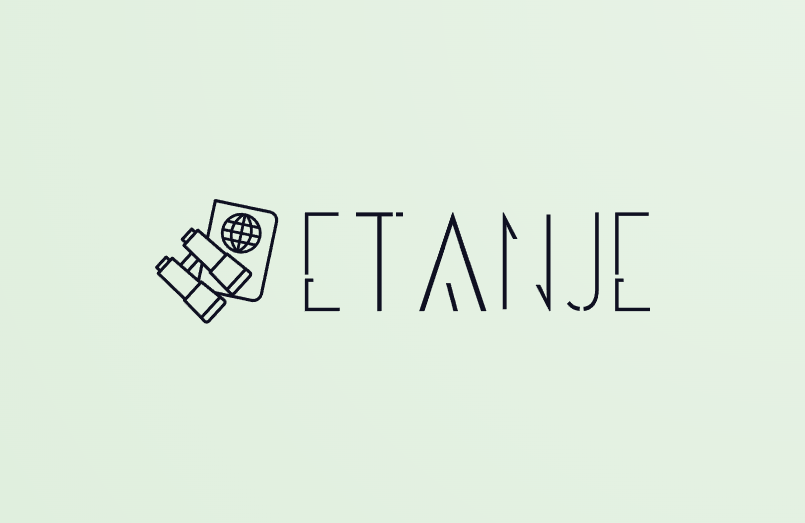

# ŠETANJE

## O naši aplikaciji

Naša mobilna aplikacija uporabnikom omogoča odkrivanje znamenitosti na edinstven in interaktiven način. 
Ko uporabnik začne svojo pot, mu aplikacija postavi vprašanje, ki ga usmerja k določeni znamenitosti. 
Njegova naloga je, da to znamenitost poišče in ob tem uživa v raziskovanju okolice. 
Med raziskovanjem lahko uporabnik koristi tudi možnost dodatnih vprašanj, s katerimi pridobi dodatne točke. 
Rezultate svojega raziskovanja lahko primerja z drugimi uporabniki na lestvici najboljših. 
Aplikacija združuje zabavo in izobraževanje ter spodbuja k raziskovanju kulturnih in zgodovinskih točk na zanimiv in interaktiven način.

## Namestitev in zagon aplikacije
* Prenos projekta: Najprej prenesite projekt na svoj računalnik. Prepričajte se, da imate nameščen Node.js.
* Namestitev Expo aplikacije: Na svojem pametnem telefonu namestite aplikacijo Expo, ki bo omogočila delovanje naše aplikacije na vaši napravi.
* Namestitev paketov: Odprite terminal v korenski mapi projekta in zaženite ukaz "npm install", da prenesete vse potrebne pakete za projekt.
* Nastavitev backend strežnika: Pojdite v mapo backend in znova zaženite ukaz "npm install", da zagotovite pravilno delovanje backend strežnika.
* Zagon aplikacije: V mapi backend zaženite ukaz "npm start". Vrnite se v mapo Setanje in v terminal vpišite "npx expo start". Ta ukaz bo zagnal aplikacijo ter prikazal QR kodo.
* Povezava z mobilno napravo: Odprite Expo aplikacijo na svojem telefonu in skenirajte prikazano QR kodo. Aplikacijo lahko po želji preizkusite tudi v emulatorju na računalniku.

## Avtorji
* Lena Bojc
* Vivien Štampfer
* Nik Fišer
